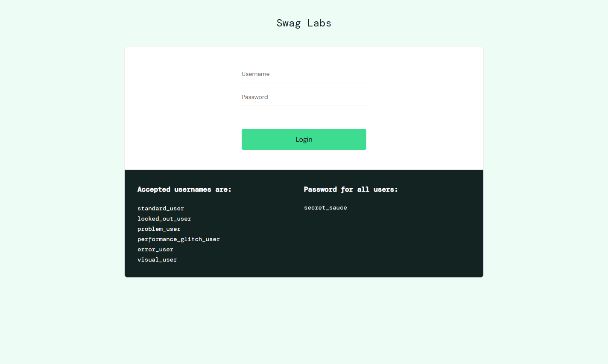
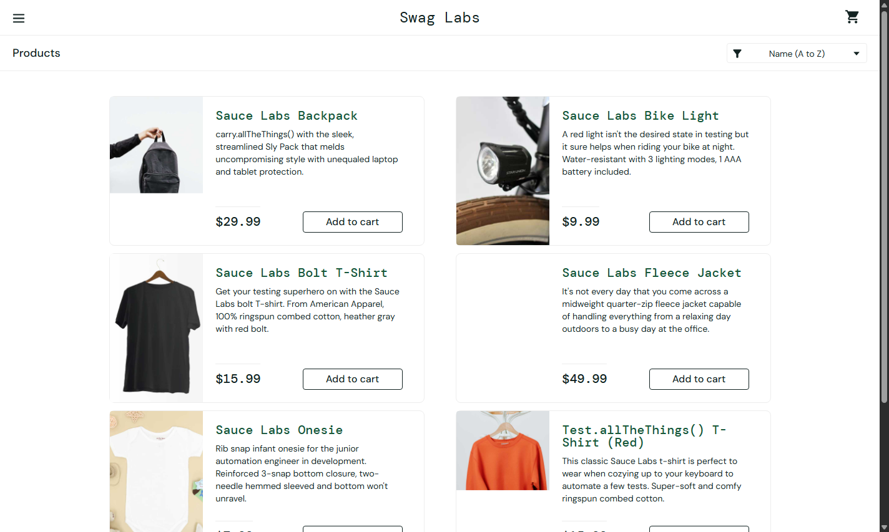
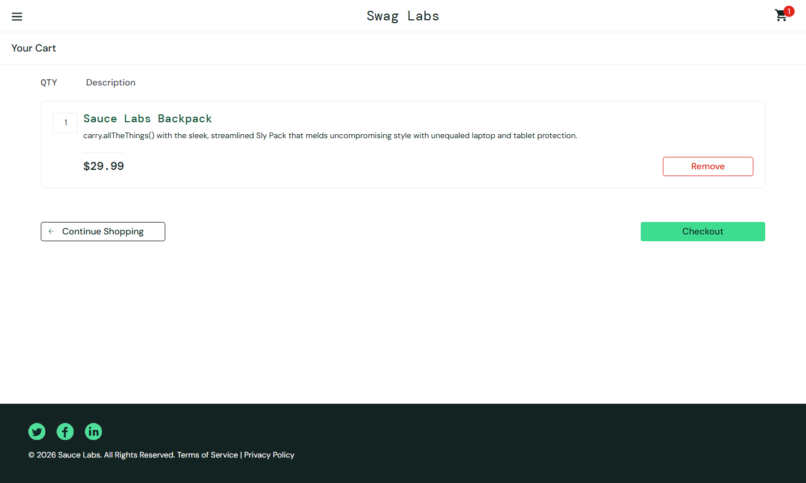
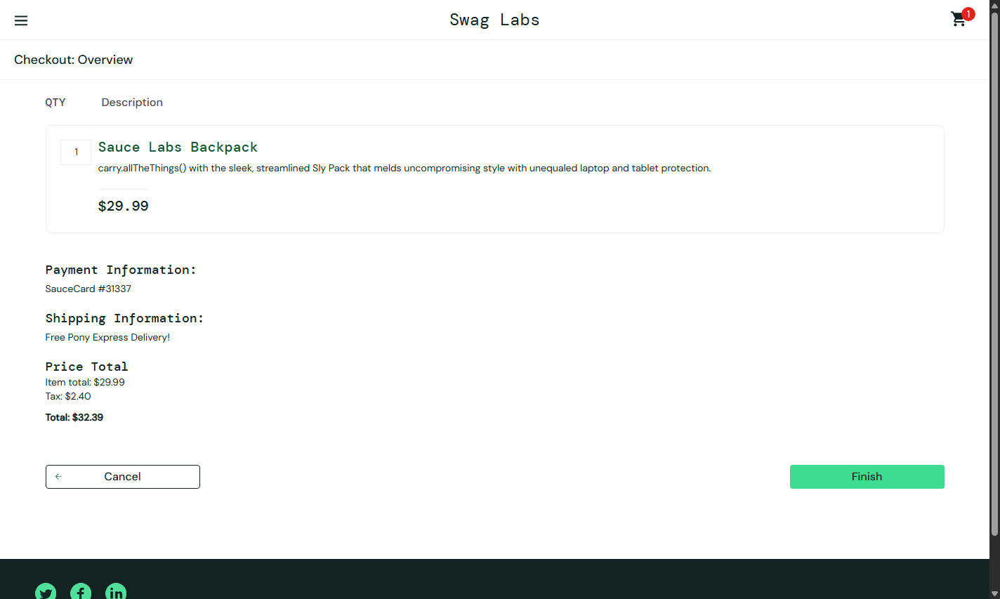
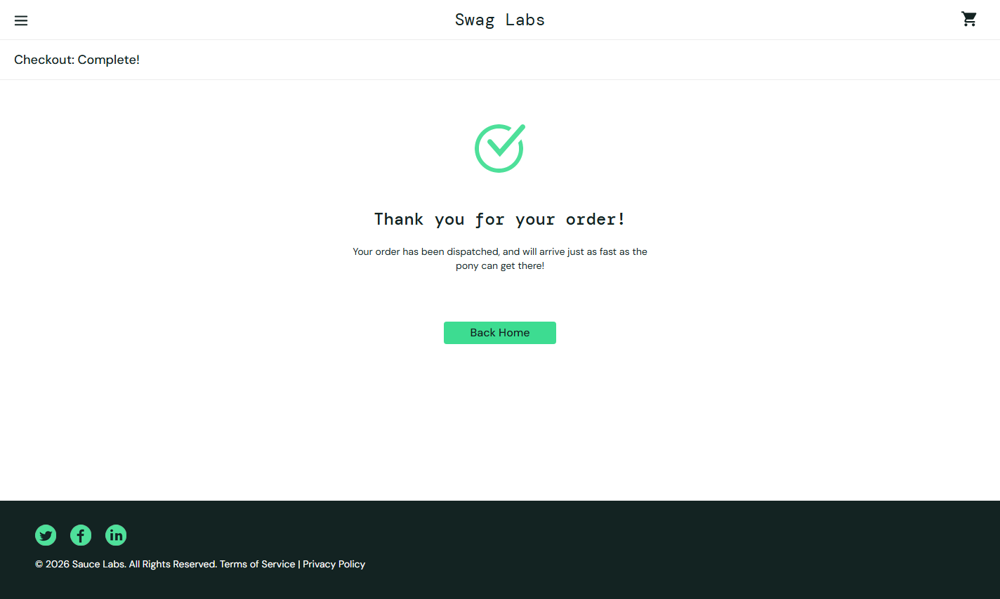

# Projeto de Automação de Testes — Petstore API e SauceDemo


Este projeto reúne dois tipos de automação de testes que aparecem bastante no dia a dia de QA:

- testes de API usando a Swagger Petstore;
- testes web usando o site SauceDemo.

A parte de API segue o guia prático de Postman e GitHub Actions: uma collection do Postman é executada pelo Newman, tanto localmente quanto na pipeline. Também mantive alguns testes em Python como cobertura extra.

A parte web automatiza um fluxo de compra no SauceDemo com Selenium e Page Object Model, incluindo screenshots quando algum teste falha.

---

## O que este projeto cobre

### API — Swagger Petstore

A automação de API está dividida em dois caminhos.

O caminho principal, usado para seguir o guia, é a collection Postman executada com Newman. Ela faz a request **Listar Pets Disponíveis** e valida duas coisas:

- a API responde com status `200`;
- o corpo da resposta é uma lista de pets.

Além disso, existem testes Python complementares com `pytest` e `requests`. Eles cobrem mais cenários da Petstore:

#### Pet

- criação de pet;
- atualização de pet;
- consulta de pet por ID;
- remoção de pet;
- consulta de pet inexistente;
- listagem de pets por status.

#### Store

- criação de pedido;
- consulta de pedido por ID;
- remoção de pedido;
- consulta de pedido inexistente;
- consulta do inventário da loja.

#### User

- criação de usuário;
- consulta de usuário;
- remoção de usuário;
- consulta de usuário inexistente.

Esses testes usam dados únicos por execução para evitar conflito com dados já existentes na API pública.

### Web — SauceDemo

A automação web cobre um fluxo de compra completo:

- login com usuário válido;
- adição do produto **Sauce Labs Backpack** ao carrinho;
- validação do produto no carrinho;
- preenchimento do checkout;
- conferência de subtotal, imposto e total;
- finalização da compra;
- validação da mensagem `Thank you for your order!`.

Também há testes negativos de login:

- campos obrigatórios vazios;
- credenciais inválidas;
- usuário bloqueado.

---

## Tecnologias usadas

- **Python 3.12+**
- **pytest** para organizar e executar os testes Python
- **requests** para chamadas HTTP nos testes Python de API
- **Postman Collection** para o teste principal de API do guia
- **Newman** para executar a collection no terminal e no GitHub Actions
- **Selenium WebDriver** para os testes web
- **pytest-html** para relatório HTML da execução web
- **python-dotenv** para configurações por variável de ambiente
- **GitHub Actions** para integração contínua

---

## Estrutura do projeto

```text
api/                    Cliente HTTP da Petstore usado nos testes Python
pages/                  Page Objects e helpers dos testes web
tests/api/              Testes Python da API Petstore
tests/web/              Testes web do SauceDemo
screenshots/            Screenshots gerados quando um teste web falha
docs/assets/            Imagens usadas neste README
.github/workflows/      Pipeline do GitHub Actions
petstore_collection.json Collection Postman usada pelo Newman
```

A organização separa API e web para facilitar manutenção. A parte web fica nos Page Objects, enquanto a parte de API concentra as chamadas HTTP em um cliente reutilizável.

---

## Como instalar

### 1. Clonar o repositório

```bash
git clone <url-do-repositorio>
cd PRojeto-automacao
```

### 2. Criar ambiente virtual

No Windows PowerShell:

```powershell
python -m venv venv
.\venv\Scripts\Activate.ps1
```

No Linux, macOS ou Git Bash:

```bash
python -m venv venv
source venv/bin/activate
```

### 3. Instalar as dependências Python

```bash
python -m pip install --upgrade pip
python -m pip install -r requirements.txt
```

Para rodar a collection Postman, não precisa instalar Newman manualmente. O comando com `npx` baixa e executa quando necessário.

---

## Configuração

O projeto já funciona com valores públicos padrão. Se precisar trocar alguma configuração, use variáveis de ambiente.

```env
PETSTORE_BASE_URL=https://petstore.swagger.io/v2
SAUCEDEMO_BASE_URL=https://www.saucedemo.com/
SAUCEDEMO_STANDARD_USER=standard_user
SAUCEDEMO_LOCKED_USER=locked_out_user
SAUCEDEMO_PASSWORD=secret_sauce
SAUCEDEMO_HEADLESS=false
SCREENSHOT_DIR=screenshots
```

Para rodar os testes web sem abrir o navegador, use:

```env
SAUCEDEMO_HEADLESS=true
```

O arquivo `env.example` mostra todas as variáveis disponíveis.

---

## Como rodar os testes

### API principal — Postman/Newman

Este é o comando principal para seguir o guia prático:

```bash
npx newman run petstore_collection.json --reporters cli
```

Resultado esperado:

```text
requests: executed 1, failed 0
assertions: executed 2, failed 0
```

As duas validações esperadas são:

- `Status code é 200`;
- `A resposta deve ser uma lista de pets`.

### API complementar — pytest

Estes testes são uma cobertura extra em Python:

```bash
pytest tests/api -q
```

### Testes web

No Windows PowerShell:

```powershell
$env:SAUCEDEMO_HEADLESS="true"
pytest tests/web -q
```

No Linux, macOS ou Git Bash:

```bash
SAUCEDEMO_HEADLESS=true pytest tests/web -q
```

### Suíte Python completa

```bash
SAUCEDEMO_HEADLESS=true pytest -q
```

### Relatório HTML dos testes web

```bash
SAUCEDEMO_HEADLESS=true pytest tests/web -q --html=report.html --self-contained-html
```

O relatório será gerado em `report.html`.

---

## Evidências do fluxo web

Os prints abaixo mostram o fluxo automatizado no SauceDemo.

### 1. Tela de login



### 2. Lista de produtos após login



### 3. Produto adicionado ao carrinho



### 4. Revisão do checkout



### 5. Compra finalizada



---

## Screenshots em caso de falha

Quando um teste web falha, o projeto salva um screenshot da tela no momento do erro.

Diretório padrão:

```text
screenshots/
```

Os arquivos `.png` dessa pasta não são versionados. A pasta fica no repositório com `.gitkeep` apenas para manter a estrutura.

---

## GitHub Actions

A pipeline roda em:

- `push`;
- `pull_request`;
- execução manual com `workflow_dispatch`.

Ela tem dois jobs separados.

### Testes Automatizados Postman

Este job executa a API conforme o guia:

- baixa os arquivos do repositório;
- instala Node.js;
- instala Newman;
- executa `petstore_collection.json`;
- valida as duas assertions da collection.

### Web tests

Este job roda os testes web:

- instala as dependências Python;
- configura o Chrome;
- executa os testes em modo headless;
- gera relatório HTML;
- publica relatório e screenshots como artifact.

---

## Estratégia técnica

Na API, o foco principal é mostrar a execução de uma collection Postman com Newman, como no guia. Os testes Python entram como complemento para mostrar uma abordagem mais programática usando `pytest` e `requests`.

Nos testes Python de API, o cliente HTTP centraliza:

- URL base;
- métodos `GET`, `POST`, `PUT` e `DELETE`;
- timeout padrão;
- leitura de JSON;
- logs de request e response;
- mensagens de erro com método, endpoint, status esperado, status recebido e body da resposta.

Na web, os testes seguem Page Object Model. Isso deixa os seletores e ações dentro das classes de página, evitando que os testes fiquem cheios de detalhes da interface.

---

## Resultado esperado

Para a API principal com Newman, o esperado é:

```text
1 request executada
2 assertions passando
0 falhas
```

Para os testes Python, a quantidade de testes pode mudar conforme novos cenários forem adicionados.

---

## Pontos de destaque

- API principal alinhada ao guia de Postman e GitHub Actions.
- Testes Python de API como cobertura complementar.
- Testes web separados da API.
- Page Object Model nos testes web.
- Screenshots automáticos em falhas web.
- Pipeline com jobs separados para API e web.
